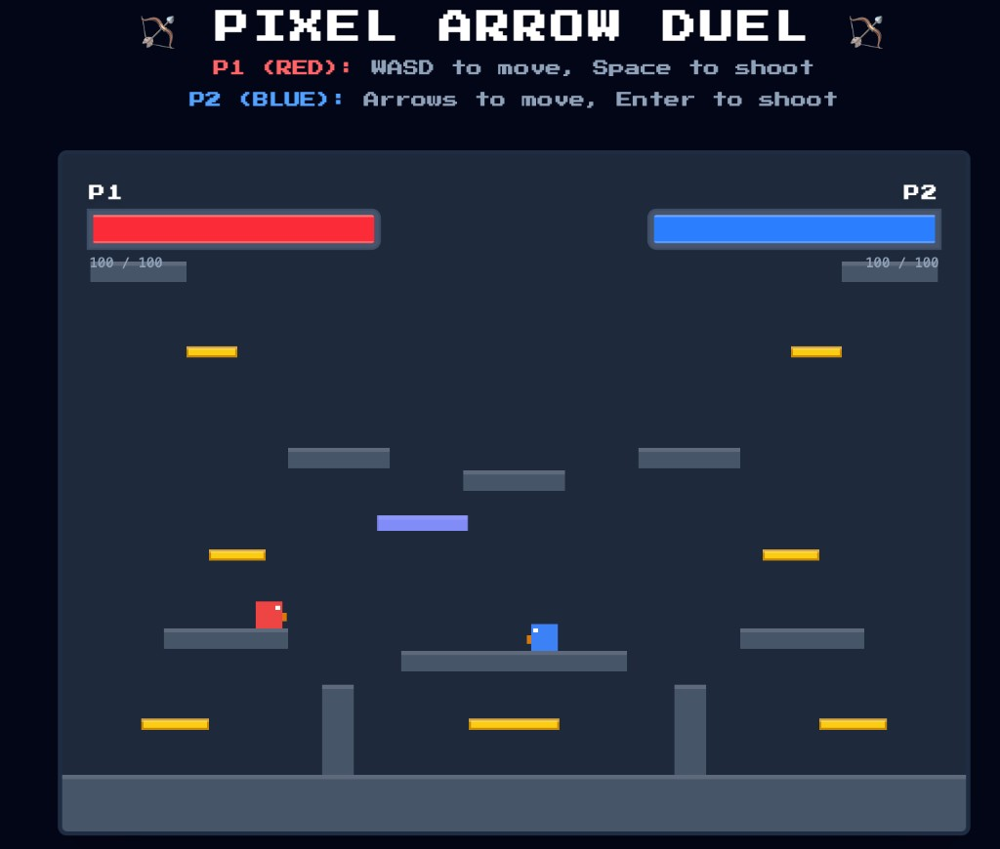

# 🎮 Pixel Arrow Duel

> A fast-paced **local multiplayer pixel platformer** where two players battle it out with bows, arrows, jumps, and perfectly timed chaos.

---



## ✨ About the Game

**Pixel Arrow Duel** is a **2D local multiplayer arena battle game** built for quick, competitive fun.  
Two players share the same keyboard and fight in a retro-inspired platform arena using movement, jumps, and arrow attacks.

The game is designed to feel energetic and satisfying, with platform-based movement, bounce mechanics, and combat moments that make every duel feel intense.

---

## 🚀 Core Highlights

- 🎯 **Two-player local multiplayer** — battle on the same keyboard
- 🕹️ **Retro pixel-art style** — blocky visuals with a nostalgic arcade vibe
- 🏟️ **Platform-based arena combat** — fight across multiple platform levels
- 🟨 **Trampoline bars** — yellow bounce platforms for extra height and mobility
- ❤️ **Live health bars** — track both players’ health in real time
- 📱 **Viewport-friendly layout** — no scrolling, no distractions, just the game
- ⌨️ **Keyboard-locked controls** — arrow keys stay inside the game instead of scrolling the page

---

## 🧩 Gameplay Overview

Each player controls their own character and uses movement, jumping, and shooting to outplay the other.

The arena includes:

- **Multiple solid platforms** for movement and positioning
- **Yellow trampoline bars** for boosted jumps
- **A moving platform** to add more unpredictability and strategy

The objective is simple:

> **Hit your opponent with arrows and reduce their health to zero before they do the same to you.**

---

## 🎮 Controls

| Player        | Move         | Jump | Shoot   |
| ------------- | ------------ | ---- | ------- |
| **P1 (Red)**  | `WASD`       | `W`  | `Space` |
| **P2 (Blue)** | `Arrow Keys` | `↑`  | `Enter` |

---

## 🏆 How to Win

- Hit your opponent with arrows to reduce their health
- Use the platforms smartly to dodge and gain better angles
- Jump on **yellow bars** to launch higher into the air
- Falling off the map or taking too much damage will cost health
- The first player to lose all health **loses the round**
- A new match starts automatically after a winner is decided

---

## 🛠️ Tech Stack

Built using a modern frontend setup:

- **React 19**
- **TypeScript**
- **Vite 7**
- **Tailwind CSS v4** via `@tailwindcss/vite`
- **Press Start 2P** (Google Fonts) for pixel typography

---

## 📦 Getting Started

Run the project locally with:

```bash
npm install
npm run dev
```

Then open the local URL shown in the terminal:

```
http://localhost:5173
```

---

## 📜 Available Scripts

| Command           | Description                         |
| ----------------- | ----------------------------------- |
| `npm run dev`     | Start development server with HMR   |
| `npm run build`   | TypeScript check + production build |
| `npm run preview` | Serve production build locally      |
| `npm run lint`    | Run ESLint                          |

---

## 🎨 Design Style

The game follows a **retro arcade-inspired visual style** featuring:

- Pixel typography
- Bold character colors
- Minimal HUD elements
- Smooth and responsive gameplay

The focus is on **fun, speed, and competitive gameplay** while keeping the visuals simple and nostalgic.

---

## 📄 License

**Private / Unlicensed**

Unless explicitly stated otherwise, this project is not licensed for public use or redistribution.

---

## 💥 Summary

**Pixel Arrow Duel** is a competitive local multiplayer platform fighter where:

- movement matters
- timing matters
- aim matters

…and friendships might not survive the match.
